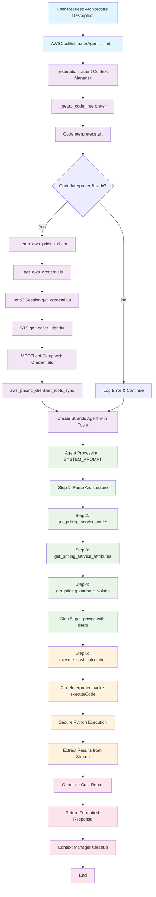

# AWS Cost Estimator Agent Flow Diagram

## Key Components

### 🔧 **Initialization Phase**
- **AWSCostEstimatorAgent**: Main orchestrator
- **Region Setup**: Uses boto3 default or specified region
- **Logging Configuration**: Comprehensive error tracking

### 🛠️ **Setup Phase**
- **Code Interpreter**: Secure AgentCore sandbox initialization
- **AWS Credentials**: Retrieval with session token support
- **MCP Client**: AWS Pricing server with credential injection
- **Tool Integration**: Combines custom and MCP tools

### 🤖 **Processing Phase**
- **Architecture Parsing**: Identifies AWS services
- **Pricing Data Retrieval**: Sequential MCP tool calls
- **Secure Calculations**: AgentCore Code Interpreter execution
- **Result Formatting**: Structured cost report generation

### 🔄 **Resource Management**
- **Context Manager**: Ensures proper cleanup
- **Error Handling**: Graceful fallbacks throughout
- **Stream Processing**: Real-time response capability

## Tool Flow Sequence

1. `get_pricing_service_codes` → Available AWS services
2. `get_pricing_service_attributes` → Service-specific filters  
3. `get_pricing_attribute_values` → Valid attribute values
4. `get_pricing` → Actual pricing data with filters
5. `execute_cost_calculation` → Mathematical operations in sandbox

## Security Features

- **Sandboxed Execution**: All calculations in AgentCore
- **Credential Management**: Secure AWS credential handling
- **Resource Isolation**: Proper cleanup and error boundaries